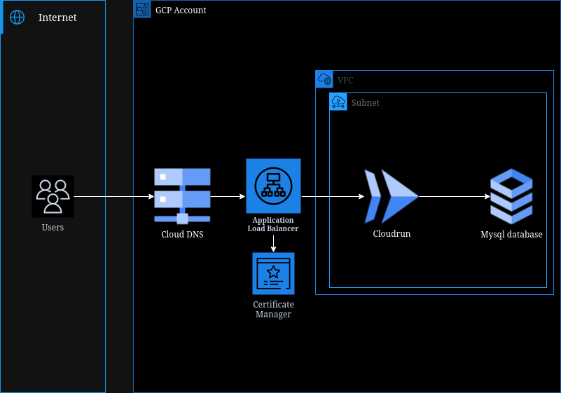

# GCP Wordpress Cloudrun deployment with CDKTF
## Architecture

## Instructions
### This deployment requires the use of user Access Keys.
To deploy using deploy using Terraform Cloud, uncomment lines 8, 69-76 in main.ts and comment out line 65.

Comment out Config credentials in .github/workflows/deployment-workflow.yml

Add CDKTF_GCP_TFC_ORGANIZATION to the env block of CDKTF Deployment in .github/workflow/deployment-workflow.yml with the name of your organizatoin as the value.
### In the secrets and variables Actions menu, place the following key pairs
    1. GCP_WIP: <Workload Identity Federation Pool>
    2. GCP_SA_EMAIL: <Service Account Email>
    3. DB_USER: <database_user_name>
    4. DB_PASS: <database_password>
    5. GCP_STATE_BUCKET: <backend_bucket_to_store_state>
    6. GCP_PROJECT: <GCP Project name>

### Deploy Application:
    1. Navigate to the Actions tab
    2. Select Deployment Workflow on the left panel
    3. Select Run workflow
    4. Ensure the correct branch is selected
    6. Ensure deploy is selected in the drop down menu
    7. Run workflow

### Verify deployment by:
    1. Verify the Cloudrun deployment is stable on the Cloudrun page.
    2. Visit the FQDN created by the DNS Record stack
    
### Destroy Application:
    1. Navigate to the Actions tab
    2. Select Deployment Workflow on the left panel
    3. Select Run workflow
    4. Ensure the correct branch is selected
    6. Ensure destroy is selected in the drop down menu
    7. Run workflow
